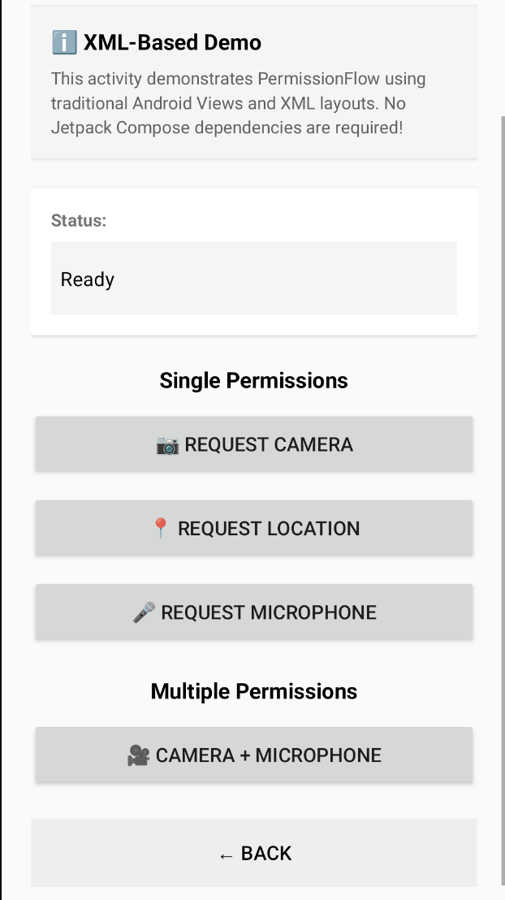

# Android Permission Flow - Runtime Permission Library

[](https://search.maven.org/artifact/com.permissionflow/permissionflow)
[](https://opensource.org/licenses/Apache-2.0)
[](https://android-arsenal.com/api?level=21)
[](https://kotlinlang.org)

A lightweight, powerful Kotlin library for handling Android runtime permissions with Flow-based API,
Jetpack Compose support, and comprehensive state management. Say goodbye to callback hell and
boilerplate code!

## ✨ Key Features

- **🌊 Flow-Based API** - Modern reactive permission handling with Kotlin Flows instead of callbacks
- **🎭 Type-Safe** - Sealed classes for all permission states (Granted, Denied, PermanentlyDenied)
- **🧠 Smart State Management** - Automatically detects "Don't ask again" state and tracks permission
  history
- **🎨 Jetpack Compose Ready** - First-class Compose support with `rememberPermissionFlow()` and
  declarative APIs
- **🔄 Lifecycle-Aware** - Automatic cleanup prevents memory leaks, handles process death gracefully
- **📦 Zero Boilerplate** - 70% less code compared to traditional permission handling
- **🧪 Easily Testable** - Includes `FakePermissionFlow` for unit testing without Android framework
- **⚡ High Performance** - Lightweight, coroutine-based, no reflection
- **🎯 Permission Groups** - Pre-built helpers for common scenarios (Camera, Location, Media, etc.)
- **🔧 Fully Customizable** - Works with Activities, Fragments, and ViewModels
- **📱 Modern Android** - Supports Android 13+ granular permissions (Media, Notifications)
- **🚀 Production Ready** - Comprehensive error handling, ProGuard rules included

## 🎯 Works with Both XML and Compose!

PermissionFlow is designed to work seamlessly in **both traditional XML-based projects and Jetpack
Compose projects**:

| Project Type               | Support                       | Compose Required? | Size Impact |
|----------------------------|-------------------------------|-------------------|-------------|
| **Traditional XML/Views**  | ✅ Full support                | ❌ No              | ~30 KB      |
| **Jetpack Compose**        | ✅ Full support + Compose APIs | ✅ Yes             | ~40-45 KB   |
| **Hybrid (XML + Compose)** | ✅ Use both approaches         | ⚠️ Optional       | ~40-45 KB   |

**Key Points:**

- 📱 **XML Projects**: Use the core `PermissionFlow` class - no Compose dependencies needed!
- 🎨 **Compose Projects**: Get enhanced APIs like `rememberPermissionFlow()` and `PermissionRequired`
  composable
- 🔄 **Zero Dependency Conflicts**: Compose dependencies are optional (`compileOnly`) and only
  included if your app uses Compose
- 📚 **See [USAGE_GUIDE.md](USAGE_GUIDE.md)** for comprehensive examples of both approaches

## 📱 Demo

### Screenshots

<p align="center">
  
</p>

<p align="center">
  <em>XML-Based Demo: Traditional Android Views implementation showing single and multiple permission requests</em>
</p>

## 📦 Installation

### Maven Central (Recommended)

Add to your module's `build.gradle.kts`:

```kotlin
dependencies {
    implementation("com.permissionflow:permissionflow:1.0.0")
}
```

### JitPack (Alternative)

Add JitPack repository:

```kotlin
repositories {
    maven { url = uri("https://jitpack.io") }
}

dependencies {
    implementation("com.github.bolvitz:android-library-runtime-permission:1.0.0")
}
```

### 📏 Library Size

PermissionFlow is optimized for minimal app size impact:

**Estimated APK size increase:** ~30-50 KB after R8/ProGuard optimization

**Why so small?**

- ✅ **Zero transitive dependencies** - Only uses AndroidX libraries your app likely already has
- ✅ **R8/ProGuard optimized** - Minification enabled by default
- ✅ **Compose is optional** - If you don't use Compose features, they're excluded automatically
- ✅ **Aggressive shrinking** - Unused code is removed during compilation
- ✅ **No resources** - Pure Kotlin code with no drawables, layouts, or strings

**What's included:**

- Core permission handling (~20 KB)
- Compose integration (~10-15 KB, only if you use it)
- Helper utilities (~10-15 KB)

If your app already uses AndroidX Core, Lifecycle, and Coroutines, the actual size increase may be *
*less than 30 KB**.

## 🚀 Quick Start

### Option 1: Traditional XML/Views (No Compose Required)

```kotlin
class MainActivity : AppCompatActivity() {
    private lateinit var permissionFlow: PermissionFlow

    override fun onCreate(savedInstanceState: Bundle?) {
        super.onCreate(savedInstanceState)
        setContentView(R.layout.activity_main)

        permissionFlow = PermissionFlow(this, this)

        findViewById<Button>(R.id.btnCamera).setOnClickListener {
            lifecycleScope.launch {
                permissionFlow.requestPermission(Manifest.permission.CAMERA)
                    .collect { result ->
                        when (result) {
                            is PermissionResult.Granted -> openCamera()
                            is PermissionResult.Denied -> showRationale()
                            is PermissionResult.PermanentlyDenied -> openSettings()
                        }
                    }
            }
        }
    }
}
```

### Option 2: Jetpack Compose

```kotlin
@Composable
fun CameraScreen() {
    val permissionFlow = rememberPermissionFlow()
    var hasPermission by remember { mutableStateOf(false) }

    LaunchedEffect(Unit) {
        permissionFlow.requestCameraPermission()
            .collect { result ->
                hasPermission = result is PermissionResult.Granted
            }
    }

    if (hasPermission) {
        CameraPreview()
    } else {
        Text("Camera permission needed")
    }
}
```

## 📚 Usage Examples

### 1. Request Single Permission

```kotlin
val permissionFlow = PermissionFlow(this, this)

lifecycleScope.launch {
    permissionFlow.requestPermission(Manifest.permission.CAMERA)
        .collect { result ->
            when (result) {
                is PermissionResult.Granted -> {
                    // Permission granted - proceed with feature
                    openCamera()
                }
                is PermissionResult.Denied -> {
                    // Permission denied
                    // result.shouldShowRationale: true = show explanation
                    if (result.shouldShowRationale) {
                        showRationaleDialog()
                    }
                }
                is PermissionResult.PermanentlyDenied -> {
                    // User selected "Don't ask again"
                    showSettingsDialog()
                }
            }
        }
}
```

### 2. Request Multiple Permissions

```kotlin
permissionFlow.requestPermissions(
    Manifest.permission.CAMERA,
    Manifest.permission.RECORD_AUDIO
).collect { result ->
    when {
        result.allGranted -> {
            // All permissions granted
            startVideoRecording()
        }
        result.anyPermanentlyDenied -> {
            // Some permissions permanently denied
            showSettingsDialog(result.permanentlyDenied)
        }
        else -> {
            // Some permissions denied
            showRationaleDialog(result.denied)
        }
    }

    // Access individual results
    result.granted.forEach { permission ->
        Log.d("Permission", "$permission was granted")
    }
}
```

### 3. Check Permission Without Requesting

```kotlin
// Check current status
val status = permissionFlow.checkPermission(Manifest.permission.CAMERA)
when (status) {
    PermissionStatus.Granted -> openCamera()
    PermissionStatus.NotGranted -> showRequestButton()
    PermissionStatus.ShouldShowRationale -> showRationaleFirst()
    PermissionStatus.PermanentlyDenied -> showSettingsButton()
}

// Simple boolean check
if (permissionFlow.isPermissionGranted(Manifest.permission.CAMERA)) {
    openCamera()
}

// Check multiple permissions
val allGranted = permissionFlow.areAllPermissionsGranted(
    Manifest.permission.CAMERA,
    Manifest.permission.RECORD_AUDIO
)
```

### 4. Camera Permission Helper

```kotlin
// Simple camera request
permissionFlow.requestCameraPermission()
    .collect { result ->
        if (result is PermissionResult.Granted) {
            openCamera()
        }
    }

// Camera + Storage (handles Android version differences)
permissionFlow.requestCameraAndStorage()
    .collect { result ->
        if (result.allGranted) {
            openCameraWithStorage()
        }
    }
```

### 5. Location Permissions (Android 12+ Support)

```kotlin
// Automatically handles Android 12+ approximate/precise choice
permissionFlow.requestLocationPermissions()
    .collect { result ->
        when (result) {
            is LocationPermissionResult.PreciseGranted -> {
                // GPS location granted
                startPreciseLocationTracking()
            }
            is LocationPermissionResult.ApproximateGranted -> {
                // Approximate location granted (Android 12+)
                startApproximateLocationTracking()
            }
            is LocationPermissionResult.Denied -> {
                showLocationRationale()
            }
            is LocationPermissionResult.PermanentlyDenied -> {
                openLocationSettings()
            }
        }
    }

// Request only precise location
permissionFlow.requestPreciseLocation().collect { /* ... */ }

// Request only approximate location
permissionFlow.requestApproximateLocation().collect { /* ... */ }

// Request background location (Android 10+)
permissionFlow.requestBackgroundLocation().collect { /* ... */ }
```

### 6. Media Permissions (Android 13+ Granular)

```kotlin
// Request specific media types
permissionFlow.requestMediaPermissions(
    requestImages = true,
    requestVideos = true,
    requestAudio = false
).collect { result ->
    when {
        result.allGranted -> {
            accessAllMedia()
        }
        result.images is PermissionResult.Granted -> {
            accessImages()
        }
        result.videos is PermissionResult.Granted -> {
            accessVideos()
        }
    }
}

// Automatically handles Android version differences:
// - Android 13+: Granular permissions (READ_MEDIA_IMAGES, READ_MEDIA_VIDEO, READ_MEDIA_AUDIO)
// - Android 12 and below: READ_EXTERNAL_STORAGE
```

### 7. Notification Permission (Android 13+)

```kotlin
// Automatically granted on Android 12 and below
permissionFlow.requestNotificationPermission()
    .collect { result ->
        if (result is PermissionResult.Granted) {
            scheduleNotification()
        } else if (result is PermissionResult.PermanentlyDenied) {
            context.openNotificationSettings()
        }
    }
```

### 8. Auto-Open Settings When Permanently Denied

```kotlin
permissionFlow.requestWithSettingsFallback(
    permission = Manifest.permission.CAMERA,
    context = context
).collect { result ->
    when (result) {
        is PermissionResult.Granted -> openCamera()
        is PermissionResult.PermanentlyDenied -> {
            // Settings automatically opened
            // User will return to check permission again
        }
        else -> showRationale()
    }
}
```

### 9. Jetpack Compose - Declarative Permission Handling

```kotlin
@Composable
fun CameraScreen() {
    PermissionRequired(
        permission = Manifest.permission.CAMERA,
        rationaleContent = {
            Column(
                modifier = Modifier.padding(16.dp),
                horizontalAlignment = Alignment.CenterHorizontally
            ) {
                Text("Camera access is required to take photos")
                Spacer(modifier = Modifier.height(16.dp))
                Button(onClick = { /* Permission will be re-requested */ }) {
                    Text("Grant Permission")
                }
            }
        },
        permanentlyDeniedContent = {
            val context = LocalContext.current
            Column(
                modifier = Modifier.padding(16.dp),
                horizontalAlignment = Alignment.CenterHorizontally
            ) {
                Text("Camera permission was permanently denied")
                Spacer(modifier = Modifier.height(16.dp))
                Button(onClick = { context.openAppSettings() }) {
                    Text("Open Settings")
                }
            }
        }
    ) {
        // Main content - shown when permission is granted
        CameraPreview()
    }
}
```

### 10. Compose - Remember Permission State

```kotlin
@Composable
fun MyScreen() {
    val cameraPermission = rememberPermissionState(Manifest.permission.CAMERA)

    Column {
        when {
            cameraPermission.isGranted -> {
                CameraPreview()
            }
            cameraPermission.shouldShowRationale -> {
                Text("We need camera to take photos")
                Button(onClick = {
                    // Request permission
                }) {
                    Text("Allow Camera")
                }
            }
            cameraPermission.isPermanentlyDenied -> {
                val context = LocalContext.current
                Text("Permission permanently denied")
                Button(onClick = { context.openAppSettings() }) {
                    Text("Open Settings")
                }
            }
        }
    }
}
```

### 11. Compose - Multiple Permissions State

```kotlin
@Composable
fun VideoRecordingScreen() {
    val permissions = rememberMultiplePermissionsState(
        Manifest.permission.CAMERA,
        Manifest.permission.RECORD_AUDIO
    )

    when {
        permissions.allGranted -> {
            VideoRecordingUI()
        }
        permissions.anyPermanentlyDenied -> {
            Text("Some permissions permanently denied")
            Text("Denied: ${permissions.deniedPermissions.joinToString()}")
        }
        else -> {
            Button(onClick = { /* Request */ }) {
                Text("Grant Permissions")
            }
        }
    }
}
```

### 12. Using with ViewModel

```kotlin
class CameraViewModel(
    private val permissionFlow: PermissionFlow
) : ViewModel() {

    private val _cameraState = MutableStateFlow<CameraState>(CameraState.NoPermission)
    val cameraState: StateFlow<CameraState> = _cameraState.asStateFlow()

    fun requestCameraPermission() {
        viewModelScope.launch {
            permissionFlow.requestCameraPermission()
                .collect { result ->
                    _cameraState.value = when (result) {
                        is PermissionResult.Granted -> CameraState.Ready
                        is PermissionResult.Denied -> CameraState.ShowRationale
                        is PermissionResult.PermanentlyDenied -> CameraState.OpenSettings
                    }
                }
        }
    }
}

sealed class CameraState {
    object NoPermission : CameraState()
    object Ready : CameraState()
    object ShowRationale : CameraState()
    object OpenSettings : CameraState()
}
```

## 🔐 Permission Handling

### Open App Settings

```kotlin
// Extension function on Context
context.openAppSettings()

// Or from PermissionResult
if (result is PermissionResult.PermanentlyDenied) {
    result.openSettings(context)
}

// Using helper
SettingsHelper.openAppSettings(context)
```

### Open Notification Settings

```kotlin
context.openNotificationSettings()
// Opens notification settings on Android 8+
// Falls back to app settings on older versions
```

### Open Location Settings

```kotlin
context.openLocationSettings()
// Opens system location settings
```

### Check If Permission is Needed

```kotlin
// Check current status
val status = permissionFlow.checkPermission(Manifest.permission.CAMERA)

// Simple granted check
val isGranted = permissionFlow.isPermissionGranted(Manifest.permission.CAMERA)

// Check multiple
val allGranted = permissionFlow.areAllPermissionsGranted(
    Manifest.permission.CAMERA,
    Manifest.permission.RECORD_AUDIO
)
```

## 🗄️ State Management

### Clear Permission History

Useful when user grants permission through settings and you want to reset the "permanently denied"
state:

```kotlin
// Clear specific permission
permissionFlow.clearPermissionHistory(Manifest.permission.CAMERA)

// Clear all permission history
permissionFlow.clearAllHistory()
```

### How Permanent Denial Detection Works

PermissionFlow tracks permission requests using SharedPreferences to accurately detect when a user
selects "Don't ask again":

1. **First Request**: Permission is requested, stored as "requested"
2. **Denied + Rationale Shown**: User can see rationale, state is
   `Denied(shouldShowRationale = true)`
3. **Denied + No Rationale**: User selected "Don't ask again", state is `PermanentlyDenied`
4. **Granted**: History is cleared to allow fresh tracking

## 🎯 API Reference

### PermissionFlow Methods

```kotlin
class PermissionFlow(activity: ComponentActivity, lifecycleOwner: LifecycleOwner)
class PermissionFlow(fragment: Fragment, lifecycleOwner: LifecycleOwner)

// Request single permission
fun requestPermission(permission: String): Flow<PermissionResult>

// Request multiple permissions
fun requestPermissions(vararg permissions: String): Flow<MultiPermissionResult>

// Check status without requesting
fun checkPermission(permission: String): PermissionStatus
fun isPermissionGranted(permission: String): Boolean
fun areAllPermissionsGranted(vararg permissions: String): Boolean

// Clear history
fun clearPermissionHistory(permission: String)
fun clearAllHistory()
```

### Permission Result Types

```kotlin
sealed class PermissionResult {
    object Granted : PermissionResult()
    data class Denied(val shouldShowRationale: Boolean) : PermissionResult()
    object PermanentlyDenied : PermissionResult()
}

sealed class PermissionStatus {
    object Granted : PermissionStatus()
    object NotGranted : PermissionStatus()
    object ShouldShowRationale : PermissionStatus()
    object PermanentlyDenied : PermissionStatus()
}

data class MultiPermissionResult(
    val granted: List<String>,
    val denied: List<String>,
    val permanentlyDenied: List<String>,
    val results: Map<String, PermissionResult>
) {
    val allGranted: Boolean
    val anyPermanentlyDenied: Boolean
}
```

### Permission Group Extensions

```kotlin
// Camera
fun PermissionFlow.requestCameraPermission(): Flow<PermissionResult>
fun PermissionFlow.requestCameraAndStorage(): Flow<MultiPermissionResult>

// Location
fun PermissionFlow.requestLocationPermissions(): Flow<LocationPermissionResult>
fun PermissionFlow.requestPreciseLocation(): Flow<LocationPermissionResult>
fun PermissionFlow.requestApproximateLocation(): Flow<LocationPermissionResult>
fun PermissionFlow.requestBackgroundLocation(): Flow<LocationPermissionResult>

// Media (Android 13+)
fun PermissionFlow.requestMediaPermissions(
    requestImages: Boolean = true,
    requestVideos: Boolean = true,
    requestAudio: Boolean = true
): Flow<MediaPermissionResult>

// Notifications (Android 13+)
fun PermissionFlow.requestNotificationPermission(): Flow<PermissionResult>

// Others
fun PermissionFlow.requestMicrophonePermission(): Flow<PermissionResult>
fun PermissionFlow.requestContactsPermission(): Flow<PermissionResult>
fun PermissionFlow.requestPhonePermission(): Flow<PermissionResult>
fun PermissionFlow.requestSmsPermissions(): Flow<MultiPermissionResult>
fun PermissionFlow.requestCalendarPermissions(): Flow<MultiPermissionResult>
```

### Compose Functions

```kotlin
@Composable
fun rememberPermissionFlow(): PermissionFlow

@Composable
fun rememberPermissionState(permission: String): PermissionState

@Composable
fun rememberMultiplePermissionsState(vararg permissions: String): MultiplePermissionsState

@Composable
fun PermissionRequired(
    permission: String,
    rationaleContent: @Composable () -> Unit,
    permanentlyDeniedContent: @Composable () -> Unit,
    content: @Composable () -> Unit
)

@Composable
fun MultiplePermissionsRequired(
    permissions: List<String>,
    rationaleContent: @Composable (deniedPermissions: List<String>) -> Unit,
    permanentlyDeniedContent: @Composable (permanentlyDenied: List<String>) -> Unit,
    content: @Composable () -> Unit
)

@Composable
fun RequestPermission(
    permission: String,
    key: Any? = Unit,
    onResult: (PermissionResult) -> Unit
)
```

### Settings Helpers

```kotlin
// Extension functions
fun Context.openAppSettings()
fun Context.openNotificationSettings()
fun Context.openLocationSettings()

// Helper object
object SettingsHelper {
    fun createAppSettingsIntent(context: Context): Intent
    fun openAppSettings(context: Context)
    fun createNotificationSettingsIntent(context: Context): Intent
    fun openNotificationSettings(context: Context)
    fun createLocationSettingsIntent(): Intent
    fun openLocationSettings(context: Context)
}

// Request with automatic settings fallback
fun PermissionFlow.requestWithSettingsFallback(
    permission: String,
    context: Context,
    onSettingsReturn: (() -> Unit)? = null
): Flow<PermissionResult>
```

## ⚡ Performance Tips

1. **Reuse PermissionFlow Instance**: Create once per Activity/Fragment lifecycle
   ```kotlin
   private lateinit var permissionFlow: PermissionFlow

   override fun onCreate(savedInstanceState: Bundle?) {
       permissionFlow = PermissionFlow(this, this)
   }
   ```

2. **Use Compose Remember**: In Compose, always use `rememberPermissionFlow()`
   ```kotlin
   @Composable
   fun MyScreen() {
       val permissionFlow = rememberPermissionFlow() // Cached across recomposition
   }
   ```

3. **Lifecycle-Aware Collection**: Use `lifecycleScope.launch` or `LaunchedEffect`
   ```kotlin
   lifecycleScope.launch {
       permissionFlow.requestPermission(permission).collect { }
   }
   ```

4. **Check Before Requesting**: Avoid unnecessary permission dialogs
   ```kotlin
   if (!permissionFlow.isPermissionGranted(permission)) {
       permissionFlow.requestPermission(permission).collect { }
   }
   ```

5. **Clear History When Appropriate**: Reset tracking after user grants permission in settings
   ```kotlin
   override fun onResume() {
       super.onResume()
       if (permissionFlow.isPermissionGranted(permission)) {
           permissionFlow.clearPermissionHistory(permission)
       }
   }
   ```

## 🎬 Specialized Permission Groups

### Location Permissions

- **`requestLocationPermissions()`**: Handles Android 12+ approximate/precise choice automatically
- **`requestPreciseLocation()`**: Request only GPS (fine) location
- **`requestApproximateLocation()`**: Request only approximate (coarse) location
- **`requestBackgroundLocation()`**: Request background location access (Android 10+)

Returns `LocationPermissionResult`:

- `PreciseGranted`: GPS location granted
- `ApproximateGranted`: Approximate location granted
- `BackgroundGranted`: Background location granted
- `Denied(shouldShowRationale)`: Location denied
- `PermanentlyDenied`: User selected "Don't ask again"

### Media Permissions

- **`requestMediaPermissions()`**: Handles Android 13+ granular permissions automatically

On Android 13+:

- `READ_MEDIA_IMAGES`: Access photos
- `READ_MEDIA_VIDEO`: Access videos
- `READ_MEDIA_AUDIO`: Access audio files

On Android 12 and below:

- `READ_EXTERNAL_STORAGE`: Access all media

Returns `MediaPermissionResult` with individual results for images, videos, and audio.

### Camera & Storage

- **`requestCameraAndStorage()`**: Automatically handles Android version differences
    - Android 10+: Only requests camera (scoped storage)
    - Android 9 and below: Requests camera + write external storage

## ❌ Error Handling

PermissionFlow handles errors gracefully:

```kotlin
try {
    permissionFlow.requestPermission(Manifest.permission.CAMERA)
        .catch { exception ->
            // Handle Flow errors
            Log.e("Permission", "Error requesting permission", exception)
        }
        .collect { result ->
            // Handle result
        }
} catch (e: IllegalStateException) {
    // PermissionFlow not registered before onCreate
    Log.e("Permission", "Register PermissionFlow in onCreate", e)
}
```

Common errors:

- `IllegalStateException`: PermissionFlow created after `onCreate()` lifecycle event
- `IllegalArgumentException`: Invalid context type (must be ComponentActivity)

## 📋 Requirements

- **Minimum SDK**: 21 (Android 5.0 Lollipop)
- **Target SDK**: 34 (Android 14)
- **Compile SDK**: 34
- **Language**: Kotlin 1.9+

### Dependencies

```kotlin
// Required
implementation("androidx.core:core-ktx:1.12.0")
implementation("androidx.lifecycle:lifecycle-runtime-ktx:2.6.2")
implementation("org.jetbrains.kotlinx:kotlinx-coroutines-core:1.7.3")
implementation("org.jetbrains.kotlinx:kotlinx-coroutines-android:1.7.3")

// For Compose features
implementation("androidx.compose.runtime:runtime:1.5.4")
implementation("androidx.activity:activity-compose:1.8.1")
```

All dependencies are automatically included when you add PermissionFlow to your project.

## 📱 Sample App

The library includes a comprehensive sample app demonstrating all features.

### 🚀 Quick Start

**Want to run the sample app in Android Studio?**
See the complete setup guide: **[SETUP.md](./SETUP.md)**

```bash
# Clone the repository
git clone https://github.com/bolvitz/android-library-runtime-permission.git

# Open in Android Studio
cd android-library-runtime-permission

# Open the project in Android Studio and run the 'sample' module
# Or build from command line:
./gradlew :sample:installDebug
```

The sample app includes examples of:

- ✅ Single permission requests (Camera, Microphone, etc.)
- ✅ Multiple permission requests
- ✅ Permission groups (Location, Media, Notifications)
- ✅ Jetpack Compose integration
- ✅ Settings navigation
- ✅ Rationale handling
- ✅ "Don't ask again" scenarios
- ✅ ViewModel integration
- ✅ Real-world use cases

## 🧪 Testing

### Unit Testing with FakePermissionFlow

```kotlin
class CameraViewModelTest {

    @Test
    fun `when camera permission granted, should open camera`() = runTest {
        // Arrange
        val fakePermissionFlow = FakePermissionFlow()
        fakePermissionFlow.setPermissionResult(
            Manifest.permission.CAMERA,
            PermissionResult.Granted
        )

        val viewModel = CameraViewModel(fakePermissionFlow)

        // Act
        viewModel.requestCameraPermission()

        // Assert
        assertEquals(CameraState.Ready, viewModel.cameraState.value)
    }

    @Test
    fun `when camera permission denied, should show rationale`() = runTest {
        val fakePermissionFlow = FakePermissionFlow()
        fakePermissionFlow.setPermissionResult(
            Manifest.permission.CAMERA,
            PermissionResult.Denied(shouldShowRationale = true)
        )

        val viewModel = CameraViewModel(fakePermissionFlow)
        viewModel.requestCameraPermission()

        assertEquals(CameraState.ShowRationale, viewModel.cameraState.value)
    }
}
```

### Using Builder DSL

```kotlin
@Test
fun `test multiple permission scenarios`() = runTest {
        val fakePermissionFlow = fakePermissionFlow {
            permission(Manifest.permission.CAMERA) {
                granted()
            }
            permission(Manifest.permission.RECORD_AUDIO) {
                denied(shouldShowRationale = true)
            }
            permission(Manifest.permission.READ_CONTACTS) {
                permanentlyDenied()
            }
        }

        // Use in tests
        val viewModel = MyViewModel(fakePermissionFlow)
        // ... test logic
    }
```

### Preset Test Scenarios

```kotlin
val fakePermissionFlow = FakePermissionFlow()

// Grant all permissions
fakePermissionFlow.grantAllPermissions()

// Deny all permissions
fakePermissionFlow.denyAllPermissions(shouldShowRationale = true)

// Permanently deny all
fakePermissionFlow.permanentlyDenyAllPermissions()

// Clear all for fresh state
fakePermissionFlow.clearAll()
```

## 🤝 Contributing

Contributions are welcome! Please feel free to submit a Pull Request.

1. Fork the repository
2. Create your feature branch (`git checkout -b feature/AmazingFeature`)
3. Commit your changes (`git commit -m 'Add some AmazingFeature'`)
4. Push to the branch (`git push origin feature/AmazingFeature`)
5. Open a Pull Request

## 📄 License

```
Copyright 2024 PermissionFlow

Licensed under the Apache License, Version 2.0 (the "License");
you may not use this file except in compliance with the License.
You may obtain a copy of the License at

    http://www.apache.org/licenses/LICENSE-2.0

Unless required by applicable law or agreed to in writing, software
distributed under the License is distributed on an "AS IS" BASIS,
WITHOUT WARRANTIES OR CONDITIONS OF ANY KIND, either express or implied.
See the License for the specific language governing permissions and
limitations under the License.
```

## 🔗 Links

- **GitHub
  **: [https://github.com/bolvitz/android-library-runtime-permission](https://github.com/bolvitz/android-library-runtime-permission)
- **Issues
  **: [https://github.com/bolvitz/android-library-runtime-permission/issues](https://github.com/bolvitz/android-library-runtime-permission/issues)
- **Sample App**: [/sample](./sample)
- **Documentation**: [This README](./README.md)

## ⭐ Support

If you find this library helpful, please consider:

- ⭐ Starring the repository
- 🐛 Reporting bugs and issues
- 💡 Suggesting new features
- 🔀 Contributing code improvements
- 📢 Sharing with other developers

---

**Built with ❤️ using Kotlin Flow & Jetpack Compose**

For questions, suggestions, or issues,
please [open an issue](https://github.com/bolvitz/android-library-runtime-permission/issues).
